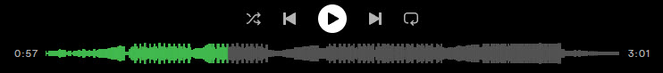

# Spicetify Waveform Seekbar

  

## Description

Waveform is a extension for Spicetify that replaces the default seekbar in the Spotify player with a dynamic waveform visualization. This extension fetches audio analysis data from Spotify's API and generates a visual representation of the track's waveform, similar to the SoundCloud player and basically all DJ software.

## Features

- **Dynamic Waveform Visualization**: Replaces the standard seekbar with a waveform representation of the current track.
- **Real-time Playback Progress**: The waveform updates in real-time to show the current playback position.
- **Interactive Seeking**: Click anywhere on the waveform to seek to that position in the track.
- **Hover Timestamps**: Displays the time at the cursor position when hovering over the waveform.
- **Adaptive Coloring**: Automatically adjusts to Spicetify's color scheme.
- **Loading Animation**: Shows a dynamic loading animation while fetching track data.
- **Error Handling**: Gracefully falls back to the original seekbar if unable to fetch waveform data.

## Installation

1. Ensure you have [Spicetify](https://github.com/khanhas/spicetify-cli) installed.
2. Download `waveform.js` from this repository.
3. Place `waveform.js` in your Spicetify extensions directory:
   - Windows: `%appdata%\spicetify\Extensions\`
   - Linux: `~/.config/spicetify/Extensions/`
   - MacOS: `~/.config/spicetify/Extensions/`
4. Add the extension name to your Spicetify config: `spicetify config extensions waveform.js`
5. Apply the changes: `spicetify apply`

Or, you can simply install this extension from the Spicetify Marketplace.

## Usage

Once installed and enabled, the extension will automatically replace the default seekbar with the waveform visualization for each track. No additional user action is required.

- **Seeking**: Click anywhere on the waveform to jump to that position in the track.
- **Time Preview**: Hover over the waveform to see the time at that position.

## Customization

The extension includes several customizable parameters:

- `DEBUG`: Set to `true` for verbose console logging.
- `SIMULATE_API_ERROR`: Set to `true` to test error handling.
- `contrastFactor`: Adjust to change the contrast of the waveform (default: 4.0).
- `maxRetryAttempts`: Number of retry attempts for API calls (default: 3).
- `retryDelay`: Delay between retry attempts in milliseconds (default: 2000).

To customize these, edit the values in the `waveform.js` file.

## Compatibility

This extension is designed to work with the latest version of Spicetify. It may require updates to maintain compatibility with future Spicetify or Spotify client updates.

## Known Issues

- The extension may not work if Spotify's audio analysis API changes or becomes unavailable.
- Some tracks may not have audio analysis data available, in which case the original seekbar will be used.
- This extension will likely not work with other extensions which also modify the seekbar.
- If the player is paused and the waveform seekbar is clicked, the progress will not update until the track begins playing again.
- Theme color changes may not apply while the track is paused. Playing the track will trigger the color updates.

## Contributing

Contributions, issues, and feature requests are welcome. Feel free to check [issues page](https://github.com/SPOTLAB-Live/Spicetify-waveform/issues) if you want to contribute.

## License

This project is licensed under the [MIT License](https://github.com/SPOTLAB-Live/Spicetify-waveform/blob/main/LICENSE.md). Feel free to use, modify, and distribute the code as per the terms of this license.

## Acknowledgements

- Inspired by this wonderful [concept by Lee Martin.](https://medium.com/swlh/creating-waveforms-out-of-spotify-tracks-b22030dd442b)
- Thanks to the Spicetify community for their tools and support.
